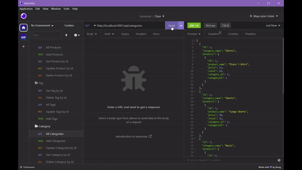

# All that Inventory 
        
## Description 📄
        

This backend application lets the user create a database of their inventory including categories, products and tags that can be assign to eachother, added, updated and removed. Many buisnesses require some way to keep their online inventory organized and up to date. This SQL database allows to create or add to any e-commerce website! I learned how to link and create a SQL based database with the help of sequelize and express servers.

## Table of Contents 📌
- [Installation](#installation)
- [Usage](#usage)
- [License](#license)
- [Credit](#credit)
- [Test](#test)
- [Contributing](#contributing)
- [Questions](#questions)

## Installation 📐

If the folder contains a package.json with dependencies listed and/or package-lock.json file, simply enter 'npm install' in the terminal. If none of those files are available or there aren't any dependencies listed in the package.json make sure to follow these steps:

1. type 'npm init' into the terminal
2. type 'npm package-name@version' for each package listed below:

- dotenv@8.2.0
- express@4.17.1
- mysql2@2.1.0
- sequelize@5.21.7

Make sure you have mySql installed properly on your computer and start mysql -u root -password and enter your password when prompted. Then run `SOURCE ./db/schema.sql.` Next, create a file name .env and add the folloing into it: 

DB_NAME='ecommerce_db'
DB_USER='root'
DB_PASSWORD='password' 

where it says 'password' make sure to add your own SQL password.

## Usage 💻

Once the all npms installed and the schema.sql is sourced, the server can be started using node index.js in the intergrated terminal.
This application allows the user to add, update and remove Categories, Tags and Products through the api routes:

- /api/products
- /api/tags
- /api/categories

## License 🔑

This project is covered under the MIT license.

## Questions 📫

Find me on GitHub: https://github.com/Mayalynn96

Or email me at: Mayalynncohen@gmail.com